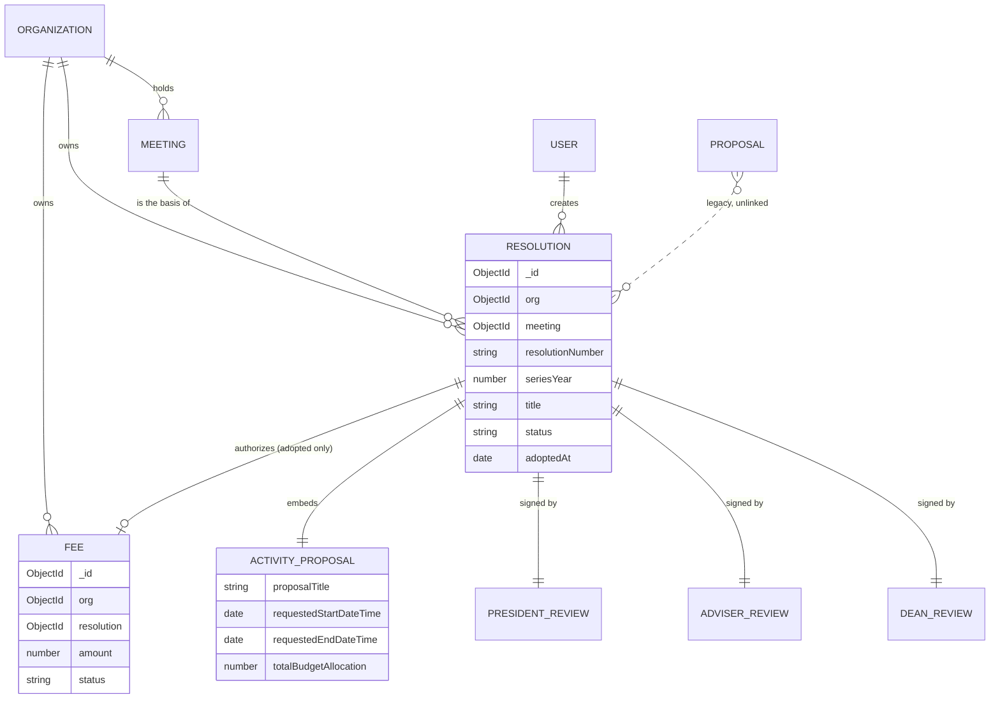
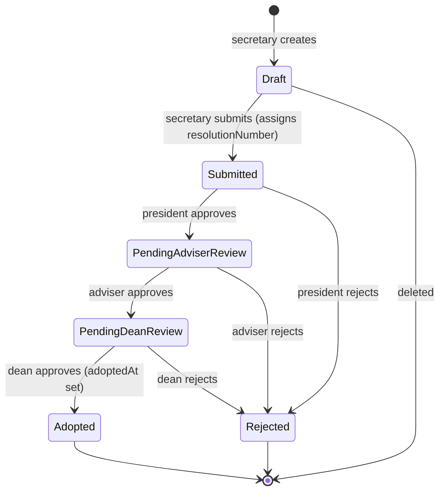
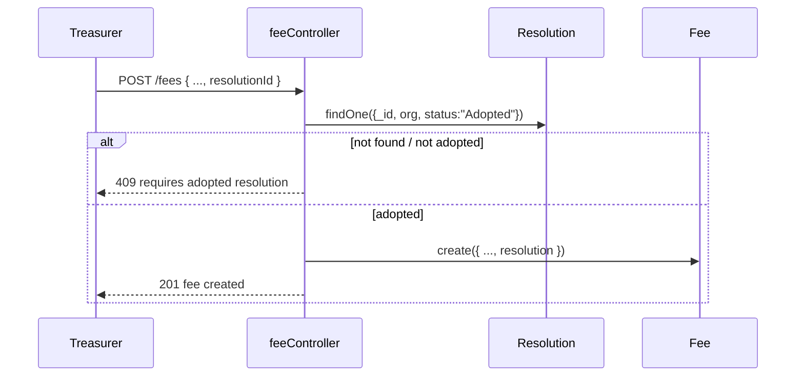
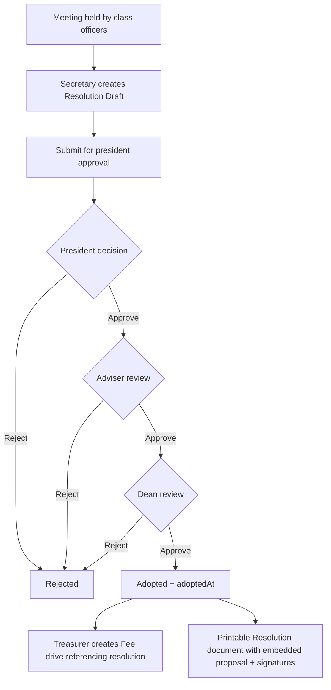

# Resolution Workflow — Architecture Plan (SOMIS)

Status: Draft for implementation. Target implementer: Code mode. Scope:
Introduce a first-class `Resolution` document that wraps an **embedded**
activity proposal, replace the standalone `Proposal` review pipeline as the
primary activity-approval path, and gate fee drives on an **adopted**
resolution.

---

## 0. Authoritative process (from task)

1. Class officers hold a **meeting** first.
2. The **secretary creates a Resolution** and submits it for the **president's**
   approval.
3. The approved resolution is passed to the **adviser** for review.
4. The **activity proposal is embedded inside the Resolution** (subdocument, not
   a referenced top-level document).
5. The Resolution (with embedded proposal) is reviewed by **president, adviser,
   dean**, each recording a decision + digital signature.
6. Only an **adopted** Resolution may be attached to a collection of dues
   (**Fee**). A fee drive cannot be created without referencing an adopted
   resolution.

---

## 1. Decisions and assumptions (confirm or override)

| #   | Decision                                                                                                                                                                                                                      | Rationale / alternative                                                                                                                                                                                                                                                                      |
| --- | ----------------------------------------------------------------------------------------------------------------------------------------------------------------------------------------------------------------------------- | -------------------------------------------------------------------------------------------------------------------------------------------------------------------------------------------------------------------------------------------------------------------------------------------- |
| A1  | Review chain is **president → adviser → dean only**. No OVPSAS/admin step for resolutions.                                                                                                                                    | Explicit assumption in task. `REVIEW_RULES` omits `admin`.                                                                                                                                                                                                                                   |
| A2  | **One** persisted president review record (`presidentReview`), written at step 2. The president is also rendered in the final "Adoption Signatories" block of the document (step 5 is presentational, not a second DB field). | Resolves the internal contradiction "approves once … signs again". **Override option:** if a distinct second ratification is truly required, add a terminal `presidentRatificationReview` subdoc and a `Pending President Ratification` status after dean — flag as extension, not baseline. |
| A3  | **`Adopted` is the terminal success status**, reached when the dean approves. `Rejected` is terminal on any rejection.                                                                                                        | Mirrors existing `Approved`/`Rejected` semantics; keeps fee gate simple (`status === "Adopted"`).                                                                                                                                                                                            |
| A4  | Activity proposal is an **embedded subdocument** `activityProposal` on Resolution.                                                                                                                                            | Explicit requirement (step 4).                                                                                                                                                                                                                                                               |
| A5  | Meeting attendance/quorum capture is **out of scope** this iteration.                                                                                                                                                         | Explicit assumption in task.                                                                                                                                                                                                                                                                 |
| A6  | A Resolution references **exactly one** `Meeting` in the same organization, and that meeting must have already occurred (`endDateTime <= now`) at submit time.                                                                | Enforces "meeting first". Enforce met-at-submit in controller; make the "already occurred" rule a single constant so it can be relaxed.                                                                                                                                                      |
| A7  | Existing `Proposal` model/routes are **retained (dual-run)**, not deleted.                                                                                                                                                    | Migration safety; other dashboards still consume proposals.                                                                                                                                                                                                                                  |
| A8  | `Fee.resolution` is required **for new fee documents only** (schema `isNew` hook + controller check), not retroactively.                                                                                                      | Protects legacy Fee records from `save()`/validation regressions.                                                                                                                                                                                                                            |

Open question to confirm before merge: **A2** (single vs double president
signature). Baseline design assumes single.

---

## 2. Data model

### 2.1 New model: `backend/src/models/Resolution.js`

Status enum:
`"Draft" | "Submitted" | "Pending Adviser Review" | "Pending Dean Review" | "Adopted" | "Rejected"`

Top-level shape:

```js
{
  org:        { type: ObjectId, ref: "Organization", required: true, index: true },
  meeting:    { type: ObjectId, ref: "Meeting", required: true, index: true },     // meeting-first
  resolutionNumber: { type: String, trim: true, uppercase: true, default: "" },     // assigned on submit
  seriesYear:       { type: Number },                                               // calendar year of adoption series
  title:      { type: String, required: true, trim: true, maxlength: 200 },
  subject:    { type: String, trim: true, maxlength: 300, default: "" },            // "A RESOLUTION ..."
  whereasClauses: { type: [String], default: [] },                                  // WHEREAS ...
  resolvedClauses:{ type: [String], required: true, validate: min 1 },              // RESOLVED, That ...
  activityProposal: { type: activityProposalSchema, required: true },               // embedded
  attachments: [ attachmentSchema ],                                                // resolution-level docs
  createdBy:  { type: ObjectId, ref: "User", required: true },
  status:     { type: String, enum: [...], default: "Draft" },
  submittedAt: Date,

  presidentReview: reviewSchema,   // step 2 (org_admin)
  adviserReview:   reviewSchema,   // step 3
  deanReview:      reviewSchema,   // step 5 → Adopted

  adoptedAt: Date,
  adoptedBy: { type: ObjectId, ref: "User" },
}
```

Reusable inner schemas (define once in this file; no `_id` on clause arrays):

```js
const attachmentSchema = new mongoose.Schema(
  {
    originalName: String,
    filename: String,
    path: String,
    mimetype: String,
    size: Number,
  },
  { _id: true },
);

const reviewSchema = new mongoose.Schema(
  {
    decision: { type: String, enum: ["Approved", "Rejected"] },
    digitalSignature: { type: String, trim: true, maxlength: 150 },
    remarks: { type: String, trim: true, maxlength: 500, default: "" },
    reviewedBy: { type: ObjectId, ref: "User" },
    reviewedAt: Date,
  },
  { _id: false },
);

const activityProposalSchema = new mongoose.Schema(
  {
    proposalTitle: { type: String, required: true, trim: true, maxlength: 150 },
    activityCategory: {
      type: String,
      required: true,
      enum: [
        /* same enum as Proposal.activityCategory */
      ],
    },
    projectObjectives: { type: String, required: true, trim: true },
    projectDescription: { type: String, required: true, trim: true },
    requestedStartDateTime: { type: Date, required: true },
    requestedEndDateTime: { type: Date, required: true },
    targetVenue: {
      type: String,
      required: true,
      enum: [
        /* same as Proposal.targetVenue */
      ],
    },
    expectedAttendees: { type: Number, required: true, min: 1 },
    targetAudience: {
      type: String,
      required: true,
      enum: [
        /* same as Proposal.targetAudience */
      ],
    },
    totalBudgetAllocation: { type: Number, required: true, min: 0 },
    sourceOfFunds: { type: String, required: true, trim: true, maxlength: 200 },
    projectLeadPerson: { type: String, required: true, trim: true },
    projectLeadContact: { type: String, required: true, trim: true },
    requiresFeeCollection: { type: Boolean, default: false }, // hints fee linkage; optional guard for step 6
    attachments: { type: [attachmentSchema], default: [] },
  },
  { _id: false },
);
```

Indexes:

```js
resolutionSchema.index({ org: 1, status: 1, createdAt: -1 });
resolutionSchema.index({ meeting: 1 });
resolutionSchema.index(
  { org: 1, resolutionNumber: 1 },
  {
    unique: true,
    partialFilterExpression: { resolutionNumber: { $type: "string", $ne: "" } },
  },
);
```

Validation hooks (`pre("validate")`):

1. `activityProposal.requestedEndDateTime > requestedStartDateTime` →
   `invalidate`.
2. `resolvedClauses.length >= 1` (and each clause non-empty after trim).
3. `resolutionNumber` required when `status !== "Draft"`.
4. `status === "Adopted"` requires a `deanReview.decision === "Approved"` with
   `reviewedAt`.

`resolutionNumber` format: `RES-<seriesYear>-<3-digit seq>`, unique per org per
series year. Generate with `countDocuments({ org, seriesYear }) + 1`, then retry
once on duplicate-key error (11000).

### 2.2 Change to `Fee` (`backend/src/models/Fee.js`)

Add field and index; enforce only for new documents:

```js
resolution: { type: ObjectId, ref: "Resolution", default: null, index: true },

feeSchema.index({ org: 1, resolution: 1 });

feeSchema.pre("validate", function () {
  if (this.isNew && !this.resolution) {
    this.invalidate("resolution", "An adopted resolution is required to create a fee drive.");
  }
});
```

`resolution` is intentionally **not** `required: true` at schema level so legacy
Fee documents remain valid on `save()`.

### 2.3 Relationship to `Meeting` and to legacy `Proposal`

- `Meeting` is **unchanged** (no new fields, no migration). Resolution holds the
  forward reference `meeting`.
- One meeting may have many resolutions; a resolution has exactly one meeting.
- `Proposal` is **unchanged** and remains readable (dual-run). No automatic
  back-population. See §7.

### 2.4 ER diagram



---

## 3. Review state machine

Reuse the `REVIEW_RULES` pattern from
[`proposalController.js`](backend/src/controllers/proposalController.js:399).

```js
const REVIEW_RULES = {
  org_admin: {
    expectedStatus: "Submitted",
    nextStatus: "Pending Adviser Review",
    reviewField: "presidentReview",
    reviewerLabel: "organization president",
    nextReviewerLabel: "faculty adviser",
    resolveSignature: resolvePresidentSignature,
  },
  adviser: {
    expectedStatus: "Pending Adviser Review",
    nextStatus: "Pending Dean Review",
    reviewField: "adviserReview",
    reviewerLabel: "faculty adviser",
    nextReviewerLabel: "department dean",
    resolveSignature: resolveAdviserSignature,
  },
  dean: {
    expectedStatus: "Pending Dean Review",
    nextStatus: "Adopted", // terminal success
    reviewField: "deanReview",
    reviewerLabel: "department dean",
    nextReviewerLabel: "",
    resolveSignature: resolveDeanSignature,
  },
};
```

Rules:

- Any `Rejected` decision → `status = "Rejected"` (terminal), regardless of
  reviewer.
- Guard: if `status` is `Adopted` or `Rejected` → `409` "already received a
  final decision".
- Guard: if `status !== rule.expectedStatus` → `409` "not ready for <reviewer>
  review".
- Signature resolved server-side; if empty → `400` prompting the reviewer to
  complete their name (same as existing).
- On dean approval set `adoptedAt = new Date()`, `adoptedBy = req.user._id`.

State diagram:



---

## 4. Backend API

### 4.1 New files

| File                                              | Purpose                                                                                                                             |
| ------------------------------------------------- | ----------------------------------------------------------------------------------------------------------------------------------- |
| `backend/src/models/Resolution.js`                | Model from §2.1                                                                                                                     |
| `backend/src/controllers/resolutionController.js` | Handlers + exported `REVIEW_RULES` for tests                                                                                        |
| `backend/src/routes/resolutionRoutes.js`          | Router from §4.3                                                                                                                    |
| `backend/src/middleware/resolutionUpload.js`      | Copy of [`proposalUpload.js`](backend/src/middleware/proposalUpload.js:1); dir `uploads/resolutions`, filename prefix `resolution-` |

### 4.2 Controller functions

Shared helpers (mirror
[`proposalController.js`](backend/src/controllers/proposalController.js:7)):
`formatMemberSignature`, `resolvePresidentSignature` (President role),
`resolveAdviserSignature` (`Faculty Adviser`), `resolveDeanSignature`
(`Department Dean`), `removeFiles`, `uploadedAttachments` (path
`/uploads/resolutions/...`), `sendValidationError`.

| Function                                                             | Behavior                                                                                                                                                                                                                                                                                                                                                                                                                                                                                                                 |
| -------------------------------------------------------------------- | ------------------------------------------------------------------------------------------------------------------------------------------------------------------------------------------------------------------------------------------------------------------------------------------------------------------------------------------------------------------------------------------------------------------------------------------------------------------------------------------------------------------------ |
| `createResolution`                                                   | Requires `req.user.organization`. Validates `meeting` exists, belongs to org, and (A6) has occurred. Parses `activityProposal.*` from multipart body; collects `activityProposal` file field + `attachments` field. Creates with `status: "Draft"`. Rolls back files on error.                                                                                                                                                                                                                                           |
| `getResolutions`                                                     | Org-scoped unless role is a faculty reviewer with cross-org access (keep org-scoped for adviser/dean, same as proposals). Role visibility filter: `adviser` → `["Pending Adviser Review","Pending Dean Review","Adopted","Rejected"]`; `dean` → `["Pending Dean Review","Adopted","Rejected"]`; `secretary`/`org_admin`/`treasurer` → all statuses for their org. Populate `org` (name, acronym, college) and `meeting` (title, startDateTime, venue, audience). Supports `?status=` filter (used for `Adopted` picker). |
| `getResolution`                                                      | Single by id, org-scoped.                                                                                                                                                                                                                                                                                                                                                                                                                                                                                                |
| `updateResolution`                                                   | Secretary only; only `Draft`/`Submitted` (before first approval). Replaces clauses, embedded proposal, retained attachments (same `retainedAttachmentIds` pattern as proposals).                                                                                                                                                                                                                                                                                                                                         |
| `submitResolution`                                                   | Secretary only; `Draft → Submitted`; validates meeting-occurred (A6) and required clauses; assigns `resolutionNumber`/`seriesYear`; sets `submittedAt`.                                                                                                                                                                                                                                                                                                                                                                  |
| `reviewResolution`                                                   | `org_admin`/`adviser`/`dean` via `REVIEW_RULES`.                                                                                                                                                                                                                                                                                                                                                                                                                                                                         |
| `getPresidentSignature` / `getAdviserSignature` / `getDeanSignature` | Return `{ data: { digitalSignature } }` (existing response shape).                                                                                                                                                                                                                                                                                                                                                                                                                                                       |
| `deleteResolution`                                                   | Secretary only; only `Draft`. Deletes files.                                                                                                                                                                                                                                                                                                                                                                                                                                                                             |
| `getAdoptableResolutions`                                            | Treasurer/secretary/org_admin; `org` + `status: "Adopted"`, lean projection `{ _id, resolutionNumber, title, adoptedAt, activityProposal.proposalTitle }`.                                                                                                                                                                                                                                                                                                                                                               |

### 4.3 Route table — mount at `/api/v1/resolutions`

Order matters: literal paths before `/:id`.

| Method | Path                   | Middleware                                                                                                                                | Handler                   |
| ------ | ---------------------- | ----------------------------------------------------------------------------------------------------------------------------------------- | ------------------------- |
| POST   | `/`                    | `protect`, `authorize("secretary")`, `resolutionUpload.fields([{name:"attachments",maxCount:5},{name:"proposalAttachments",maxCount:5}])` | `createResolution`        |
| GET    | `/`                    | `protect`                                                                                                                                 | `getResolutions`          |
| GET    | `/president-signature` | `protect`, `authorize("org_admin")`                                                                                                       | `getPresidentSignature`   |
| GET    | `/adviser-signature`   | `protect`, `authorize("adviser")`                                                                                                         | `getAdviserSignature`     |
| GET    | `/dean-signature`      | `protect`, `authorize("dean")`                                                                                                            | `getDeanSignature`        |
| GET    | `/adopted`             | `protect`, `authorize("secretary","org_admin","treasurer")`                                                                               | `getAdoptableResolutions` |
| GET    | `/:id`                 | `protect`                                                                                                                                 | `getResolution`           |
| PUT    | `/:id`                 | `protect`, `authorize("secretary")`, same `resolutionUpload.fields(...)`                                                                  | `updateResolution`        |
| PATCH  | `/:id/submit`          | `protect`, `authorize("secretary")`                                                                                                       | `submitResolution`        |
| PATCH  | `/:id/review`          | `protect`, `authorize("org_admin","adviser","dean")`                                                                                      | `reviewResolution`        |
| DELETE | `/:id`                 | `protect`, `authorize("secretary")`                                                                                                       | `deleteResolution`        |

### 4.4 RBAC matrix

| Action                                   | secretary | org_admin (president) |         adviser         |         dean         |      treasurer      | student | admin |
| ---------------------------------------- | :-------: | :-------------------: | :---------------------: | :------------------: | :-----------------: | :-----: | :---: |
| Create/edit/submit/delete own resolution |    ✅     |           –           |            –            |          –           |          –          |    –    |   –   |
| View org resolutions                     |    ✅     |          ✅           | ✅ (from adviser stage) | ✅ (from dean stage) | ✅ (list, for fees) |    –    |   –   |
| Review (sign)                            |     –     | ✅ president (step 2) |           ✅            |          ✅          |          –          |    –    |   –   |
| List adopted (fee picker)                |    ✅     |          ✅           |            –            |          –           |         ✅          |    –    |   –   |
| Create fee w/ adopted resolution         |     –     |           –           |            –            |          –           |         ✅          |    –    |   –   |

### 4.5 Mounting in `app.js`

Add `const resolutionRoutes = require("./routes/resolutionRoutes");` and
`app.use("/api/v1/resolutions", resolutionRoutes);` alongside the existing
mounts in [`app.js`](backend/src/app.js:101). No change to the `realtimeUpdates`
middleware; writes will auto-broadcast `resource: "resolutions"`.

### 4.6 Fee enforcement (`feeController.js`)

- `normalizeFeeFields` / `createFee`: read `resolutionId` (or `resolution`) from
  body. Look up
  `Resolution.findOne({ _id, org: req.user.organization, status: "Adopted" })`.
  If missing → `409`
  `{ message: "A fee drive requires an adopted resolution from this organization." }`.
  If the resolution is not `Adopted` → `409` with a status-specific message.
- Persist `resolution: resolution._id` on the Fee.
- `previewFeeTargets` unchanged.
- Optional: require `activityProposal.requiresFeeCollection` on the linked
  resolution only if declared; otherwise advisory only.

Sequence — fee creation gate:



---

## 5. Data-flow diagram



---

## 6. Frontend

### 6.1 New components (`frontend/src/component/organization-main/`)

| Component                     | Mirrors                                                                                             | Purpose                                                                                                                                                                                                                                                                                                                      |
| ----------------------------- | --------------------------------------------------------------------------------------------------- | ---------------------------------------------------------------------------------------------------------------------------------------------------------------------------------------------------------------------------------------------------------------------------------------------------------------------------- |
| `resolutionList.jsx`          | [`proposalList.jsx`](frontend/src/component/organization-main/proposalList.jsx:1)                   | Secretary management list; tabs Draft / Submitted / Adopted / Rejected; clauses + embedded proposal summary; open document, edit, submit, delete.                                                                                                                                                                            |
| `resolutionModal.jsx`         | [`proposalModal.jsx`](frontend/src/component/organization-main/proposalModal.jsx:1)                 | Create/edit form: meeting selector (fetch `/meetings`), resolution title/subject/whereas/resolved clauses, embedded activity-proposal fieldset (reuse Proposal fields), two attachment groups.                                                                                                                               |
| `resolutionDocumentModal.jsx` | [`proposalDocumentModal.jsx`](frontend/src/component/organization-main/proposalDocumentModal.jsx:1) | Printable resolution: header, WHEREAS/RESOLVED clauses, embedded "Activity Proposal" section, and "Adoption Signatories" block (president, adviser, dean) with e-signatures + dates. Add a Print button; keep `print:hidden` overlay + dedicated printable container, or switch to `window.print()` on a print-styled sheet. |
| `resolutionReview.jsx`        | [`leaderProposalReview.jsx`](frontend/src/component/organization-main/leaderProposalReview.jsx:1)   | Review UI driven by a `reviewRole` prop (`president`/`adviser`/`dean`); loads signature from `/resolutions/<role>-signature`; decision + remarks; status filter.                                                                                                                                                             |

### 6.2 Modified components

| File                                                                          | Change                                                                                                                                                                                                                                                                          |
| ----------------------------------------------------------------------------- | ------------------------------------------------------------------------------------------------------------------------------------------------------------------------------------------------------------------------------------------------------------------------------- |
| [`feesModal.jsx`](frontend/src/component/organization-main/feesModal.jsx:328) | Add required "Adopted Resolution" select loaded from `GET /resolutions/adopted`; include `resolutionId` in the POST payload; disable submit and show a guidance message when no adopted resolution exists. Add it to the `formData`/reset effect for edit mode.                 |
| [`orgDashboard.jsx`](frontend/src/pages/orgDashboard.jsx:138)                 | Add a `resolutions` tab (president review via `resolutionReview reviewRole="president"`), wire `loadResolutions`/`handleResolutionReview` next to the existing `loadProposals`/`handleProposalReview`, and add `NavCountBadge` / `MobileTabBar` counts for pending resolutions. |
| `frontend/src/component/organization-main/secretaryDashboard.jsx`             | Add a "Resolutions" section/tab for create/edit/submit/list using `resolutionList` + `resolutionModal`. Keep proposal UI available during dual-run.                                                                                                                             |
| `frontend/src/pages/adviserDashboard.jsx`                                     | Add resolutions review using `resolutionReview reviewRole="adviser"`.                                                                                                                                                                                                           |
| `frontend/src/pages/adminDashboard.jsx`                                       | Add resolutions review using `resolutionReview reviewRole="dean"`.                                                                                                                                                                                                              |

### 6.3 Shared frontend util

Add `frontend/src/util/resolutionStatus.js` exporting `STATUS_LABELS`,
`STATUS_CLASSES` (Draft/Submitted/Pending Adviser Review/Pending Dean
Review/Adopted/Rejected), `PENDING_REVIEWER_BY_STATUS`, and
`isTerminal(status)`. Reuse in all four new/modified components.

---

## 7. Migration and migration-risk notes

### 7.1 Existing `Proposal` data

- **Do not delete or migrate automatically.** Keep the model, controller, and
  [`proposalRoutes.js`](backend/src/routes/proposalRoutes.js:1) live during
  dual-run (A7).
- Existing `Approved` proposals are **not** auto-converted to Resolutions
  because there is no reliable meeting link. If conversion is later required,
  write a one-off script that (a) finds an appropriate same-org meeting on/after
  `createdAt`, (b) copies fields into `activityProposal`, (c) sets
  `status: "Adopted"`, and (d) records a synthetic `deanReview` referencing the
  original approvers — **out of scope** for this iteration.
- Risk: duplicate/confusing UI if both "Activity Proposals" and "Resolutions"
  tabs remain. Mitigation: label the proposals tab "Legacy Proposals" once
  resolutions ship, or hide it behind a flag.

### 7.2 Existing `Fee` records

- Legacy fees have no `resolution`. Because enforcement is `isNew`-only (A8),
  they load and can still be archived/patched/`save()`d.
- `treasurerArchived`, `status`, and `archiveExpiredFees` (`updateMany`, no
  validators) are unaffected.
- Risk: any code path that constructs a Fee with `new Fee(...)` outside
  `createFee` will now fail validation. Audit for direct `new Fee(` usage before
  merge.
- Risk: treasurers cannot create new fee drives until an adopted resolution
  exists. Mitigation: UI guidance + a documented admin backfill step; do not add
  a bypass flag unless requested.

### 7.3 General migration risks

- Unique partial index on `{ org, resolutionNumber }` — existing resolutions
  created before the index must not share numbers; assign numbers only via
  `submitResolution`.
- `resolutionUpload` writes to `uploads/resolutions`; ensure the directory is
  created at require time (copy the `fs.mkdirSync` guard) and that the static
  `/uploads` mount in [`app.js`](backend/src/app.js:98) already serves it.
- Socket clients key off the first path segment; resolutions will emit
  `resource: "resolutions"` — any frontend `data-updated` listener switch must
  include it (or ignore unknown resources).
- Adviser/dean org scoping: existing proposal logic uses
  `req.user.organization`; faculty accounts must have `organization` set for
  resolutions to be visible.

---

## 8. Tests

### 8.1 Backend (`node:test`, `backend/test/`)

`resolutionController.test.js`

1. `REVIEW_RULES` has exactly `org_admin`, `adviser`, `dean` (no `admin`).
2. submitted + president approve → `Pending Adviser Review`, `presidentReview`
   populated.
3. adviser approve → `Pending Dean Review`.
4. dean approve → `Adopted`, `adoptedAt` set.
5. rejection at each stage → `Rejected` terminal; further review → 409.
6. wrong-role/out-of-order review → 403/409.
7. submit assigns unique `RES-<year>-NNN`.
8. meeting-first: create/submit without `meeting` → 400; foreign-org meeting →
   404; future meeting (per A6) → 400.

`resolutionModel.test.js` 9. embedded proposal end-before-start → validation
error. 10. empty `resolvedClauses` → validation error. 11. `Adopted` without
approved `deanReview` → validation error.

`feeController.resolution.test.js` 12. `createFee` without `resolutionId` →
400/409. 13. `createFee` with non-adopted (Draft/Submitted) resolution
→ 409. 14. `createFee` with adopted resolution from another org → 404/409. 15.
`createFee` with adopted same-org resolution → success and persisted
`resolution` ref. 16. legacy Fee (no resolution) can still be loaded and
patched.

### 8.2 Frontend (`vitest`, `frontend/test/`)

`resolutionStatus.test.js` (mirror
[`meetingStatus.test.js`](frontend/test/meetingStatus.test.js:1)) 17.
`isTerminal` true for Adopted/Rejected, false otherwise. 18.
`PENDING_REVIEWER_BY_STATUS` maps Submitted → president, Pending Adviser Review
→ adviser, Pending Dean Review → dean. 19. status class lookups are defined for
all six statuses.

---

## 9. Ordered implementation task list

1. Add `backend/src/models/Resolution.js` (inner schemas, indexes, validation
   hooks).
2. Add `resolution` field + `isNew` validation hook + index to
   [`Fee.js`](backend/src/models/Fee.js:128).
3. Add `backend/src/middleware/resolutionUpload.js` (`uploads/resolutions`,
   `resolution-` prefix, same MIME allowlist).
4. Add `backend/src/controllers/resolutionController.js` (helpers,
   `REVIEW_RULES`, handlers, `getAdoptableResolutions`; export `REVIEW_RULES`
   and helpers used by tests).
5. Add `backend/src/routes/resolutionRoutes.js` per the route table.
6. Mount `/api/v1/resolutions` in [`app.js`](backend/src/app.js:101).
7. Update `createFee` in
   [`feeController.js`](backend/src/controllers/feeController.js:168) to require
   and persist an adopted same-org resolution.
8. Add `frontend/src/util/resolutionStatus.js`.
9. Add `resolutionList.jsx`, `resolutionModal.jsx`,
   `resolutionDocumentModal.jsx`, `resolutionReview.jsx`.
10. Update
    [`feesModal.jsx`](frontend/src/component/organization-main/feesModal.jsx:328)
    with the adopted-resolution selector.
11. Wire the `resolutions` tab in
    [`orgDashboard.jsx`](frontend/src/pages/orgDashboard.jsx:138); add review to
    `secretaryDashboard.jsx`, `adviserDashboard.jsx`, `adminDashboard.jsx`.
12. Add backend and frontend tests from §8.
13. Leave legacy Proposal UI/routes in place; optionally relabel as "Legacy
    Proposals".

---

## 10. Validation plan (acceptance)

- [ ] Secretary can create a resolution only against a same-org, already-held
      meeting.
- [ ] Resolution cannot be submitted without at least one RESOLVED clause and a
      valid embedded proposal.
- [ ] Review chain enforces president → adviser → dean order; wrong-order/role
      attempts return 409/403.
- [ ] Dean approval yields `Adopted`; any rejection yields terminal `Rejected`.
- [ ] `GET /resolutions/adopted` returns only adopted resolutions for the user's
      org.
- [ ] Treasurer cannot create a fee without a resolution id; non-adopted or
      cross-org ids are rejected; adopted same-org ids persist and link.
- [ ] Legacy Fee records still load, archive, and patch without validation
      errors.
- [ ] Printable resolution shows embedded proposal + president/adviser/dean
      e-signatures.
- [ ] Socket `data-updated` with `resource: "resolutions"` triggers list
      refresh.

---

## 11. Out of scope

- Meeting attendance/quorum capture (A5).
- Second president ratification signature (A2 alternative).
- Automatic migration/conversion of legacy `Proposal` documents (dual-run, A7).
- OVPSAS/admin resolution approval step (A1).
